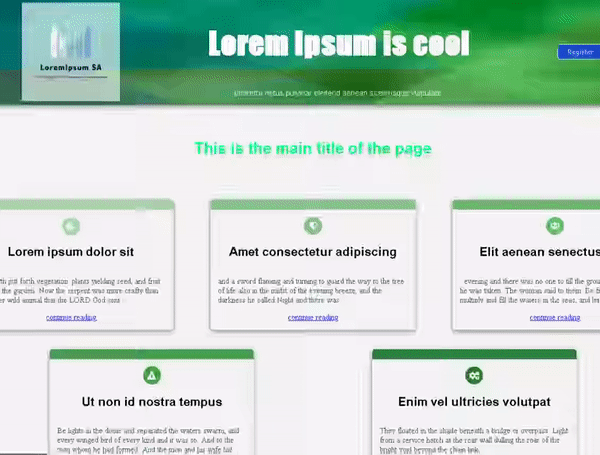

## Description

Simple responsive webpage made with Javascript ES6 Classes (OOP) to componentize all the HTML elements like React.js does, thinking in its *reusability flexibility and communication* through components of different generation levels.

Thus, the content is easy to scale and customize as we can quickly change, remove or add new content (simulating React's 'props') in the parameters.js file, which each component will render.

It looks like this:  


## Usage

First you need to install all the dependecies:

```bash
npm i
```

For changes, do them in the /src folder and rebuild the app:

```bash
npm run build
```

Open the index.html file on the browser.